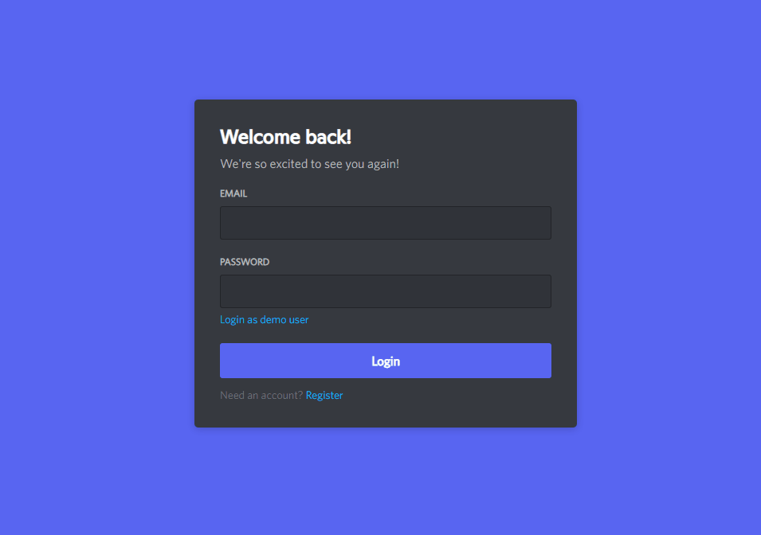
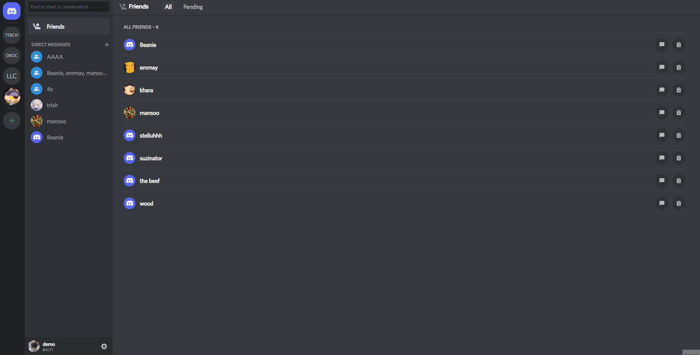
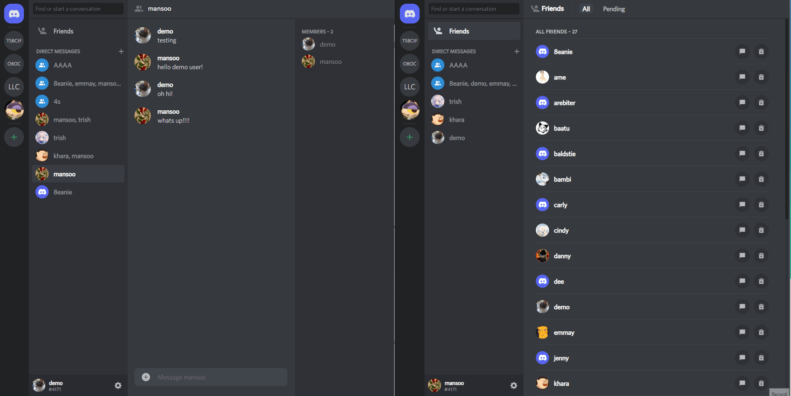
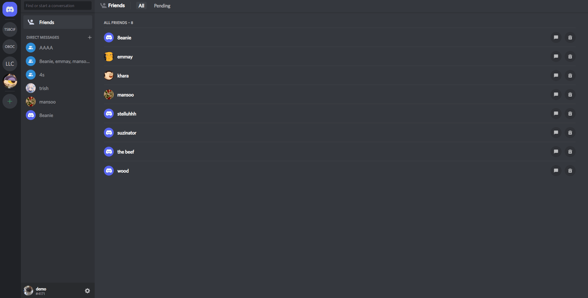
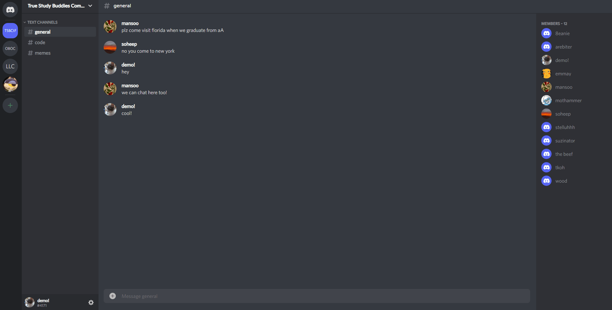

# Discode

[Discode](https://discode9.herokuapp.com/) is a Discord clone, an instant messaging platform. On Discode, users can create servers, add friends, and chat in various chatrooms such as channels, direct messages, and group chats.

## Technologies Used

Discode was implemented using React, Redux, Ruby on Rails (Action Cable WebSockets), PostgreSQL, and Amazon S3.

## Key Features

### User Authentication
- Users must have an account to access Discode.
- To minimize unecessary API requests, validations such as checking length and empty inputs are handled in React.

- After logging in, users can edit their account information and choose/change/remove their profile avatar.

### Live Chat
- Users can live chat in channels inside servers, in private direct messages, and group chats.

### Servers and Channels
- Users can create/edit/delete their own servers and channels.
- Servers can have a custom server icon.

### Friends
- Users can add/remove friends.
- Users can use the Friends tab to start new direct messages or group chats, and accept/ignore pending requests.

## Upcoming Features
- Notifications for friend requests and unread messages.
- Timestamps for messages.
